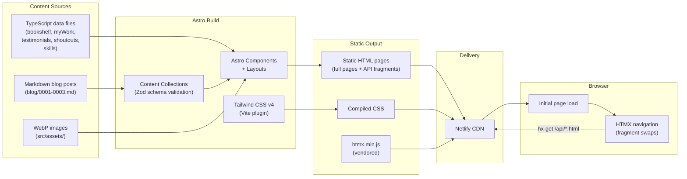
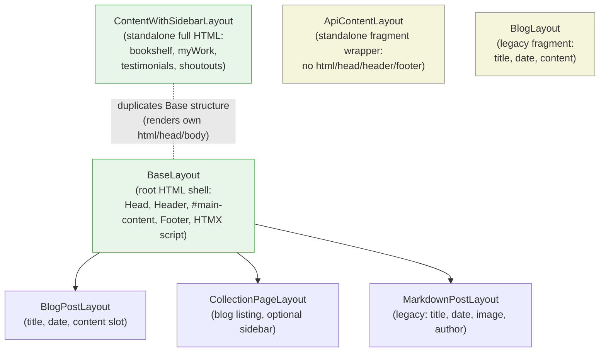
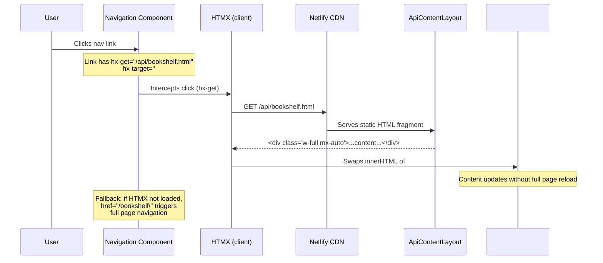

# System Architecture

## High-Level Architecture



## Layout Hierarchy



**Legend**: Green = actively used core layouts. Beige = standalone (no inheritance from BaseLayout). BlogLayout and MarkdownPostLayout are legacy layouts retained for backward compatibility.

## HTMX Navigation Flow



### HTMX Configuration

The HTMX behavior is centralized in `src/config/htmx.ts`:

```typescript
export const HTMX_CONFIG = {
    target: '#main-content',
    swap: 'innerHTML transition:true',
} as const;
```

Navigation links in `src/config/navigation.ts` define both the full-page `href` and the HTMX `api` path for each route. The `Navigation` component renders these as `<a>` elements with `hx-get`, `hx-target`, and `hx-swap` attributes.

### Endpoint Pairing

Every navigable page has a paired API endpoint:

| Full Page               | HTMX Fragment             |
| ----------------------- | ------------------------- |
| `/` (index.astro)       | `/api/home.html`          |
| `/bookshelf/`           | `/api/bookshelf.html`     |
| `/myWork/`              | `/api/myWork.html`        |
| `/shoutouts/`           | `/api/shoutouts.html`     |
| `/testimonials/`        | `/api/testimonials.html`  |
| `/blog/`                | `/api/blog.html`          |

Full pages render through `BaseLayout` or `ContentWithSidebarLayout` (complete HTML documents). API fragments render through `ApiContentLayout` (a plain `<div>` wrapper with no document shell).

## Content Data Flow

The `ContentTemplate` pattern provides a uniform rendering pipeline for four content sections:

```
ContentTemplate interface
    │
    ├── bookshelf.ts ─────┐
    ├── myWork.ts ─────────┤
    ├── testimonials.ts ───┤  Each exports ContentTemplate data
    └── shoutouts.ts ──────┘
                           │
                           ▼
              ContentWithSidebarLayout
              (or ApiContentLayout for fragments)
                           │
                    ┌──────┴──────┐
                    │             │
                 Sidebar    ContentContainer
                    │             │
               (section      ContentSection
                anchors)          │
                             SectionList
                                  │
                             ContentCard
                                  │
                              ui/Card
```

### ContentTemplate Interface

```typescript
interface ContentTemplate {
    sections: Array<{
        title: string;
        subtitle: string;
        layoutMode?: 'grid' | 'single-column';
        content: Array<{
            title: string;
            link: Link[];
            description: string;
        }>;
    }>;
}
```

Each content page passes its `ContentTemplate` data through the same component chain. The `Sidebar` component generates anchor links from section titles. The `layoutMode` property controls whether items render in a responsive grid or a single column.

## Page-to-Layout Mapping

| Page                    | Layout                      | Notes                              |
| ----------------------- | --------------------------- | ---------------------------------- |
| `index.astro`           | BaseLayout                  | Home page with skills showcase     |
| `bookshelf.astro`       | ContentWithSidebarLayout    | ContentTemplate data               |
| `myWork.astro`          | ContentWithSidebarLayout    | ContentTemplate data               |
| `testimonials.astro`    | ContentWithSidebarLayout    | ContentTemplate data               |
| `shoutouts.astro`       | ContentWithSidebarLayout    | ContentTemplate data               |
| `blog.astro`            | CollectionPageLayout        | Blog listing with optional sidebar |
| `blog/[...slug].astro`  | BlogPostLayout              | Individual blog post               |
| `api/home.html.astro`   | ApiContentLayout            | HTMX fragment                      |
| `api/bookshelf.html`    | ApiContentLayout            | HTMX fragment                      |
| `api/myWork.html`       | ApiContentLayout            | HTMX fragment                      |
| `api/shoutouts.html`    | ApiContentLayout            | HTMX fragment                      |
| `api/testimonials.html` | ApiContentLayout            | HTMX fragment                      |
| `api/blog.html`         | ApiContentLayout            | HTMX fragment                      |

## Routing Architecture

### File-Based Routing

Astro maps files in `src/pages/` to URL paths:

- `src/pages/index.astro` serves `/`
- `src/pages/bookshelf.astro` serves `/bookshelf/`
- `src/pages/api/home.html.astro` serves `/api/home.html`

### Dynamic Blog Routes

Blog posts use a catch-all route: `src/pages/blog/[...slug].astro`. This file queries the `blog` content collection and renders each post through `BlogPostLayout`. The slug is derived from the markdown filename (e.g., `0001.md` becomes `/blog/0001/`).

### API Endpoints

The `api/` directory contains `.html.astro` files that produce HTML fragments (not JSON). These exist solely for HTMX to fetch and swap into `#main-content`. They render the same content components as their full-page counterparts but wrap them in `ApiContentLayout` instead of a full document layout.

## Content Collection Schema

Blog posts are defined as an Astro content collection with a Zod schema in `src/content.config.ts`:

```typescript
const blog = defineCollection({
    type: 'content',
    schema: z.object({
        title: z.string(),
        date: z.date(),
    }),
});
```

Blog markdown files live in `src/content/blog/` and are queried at build time via Astro's `getCollection('blog')` API.

A `testimonials` collection is also defined (with an optional empty schema) but content data is primarily managed through the TypeScript `ContentTemplate` pattern rather than markdown files.

## Dark Mode Architecture

Theme switching uses a class-based strategy:

1. **Initialization** (Head.astro): An inline `<script>` runs before first paint. It reads `localStorage.getItem('theme')` and sets `document.documentElement.classList` to `'dark'` or `'light'`. This prevents a flash of unstyled content (FOUC).
2. **Toggle** (ThemeToggle component): A button with `role="switch"` toggles the `dark` class on `<html>` and persists the choice to `localStorage`.
3. **Styling**: All dark-mode styles use Tailwind's `dark:` prefix (e.g., `dark:bg-green-950`, `dark:text-gray-100`).

## See Also

- [Project Overview](project-overview-pdr.md) -- technology decisions and rationale
- [Codebase Summary](codebase-summary.md) -- file inventory and dependency table
